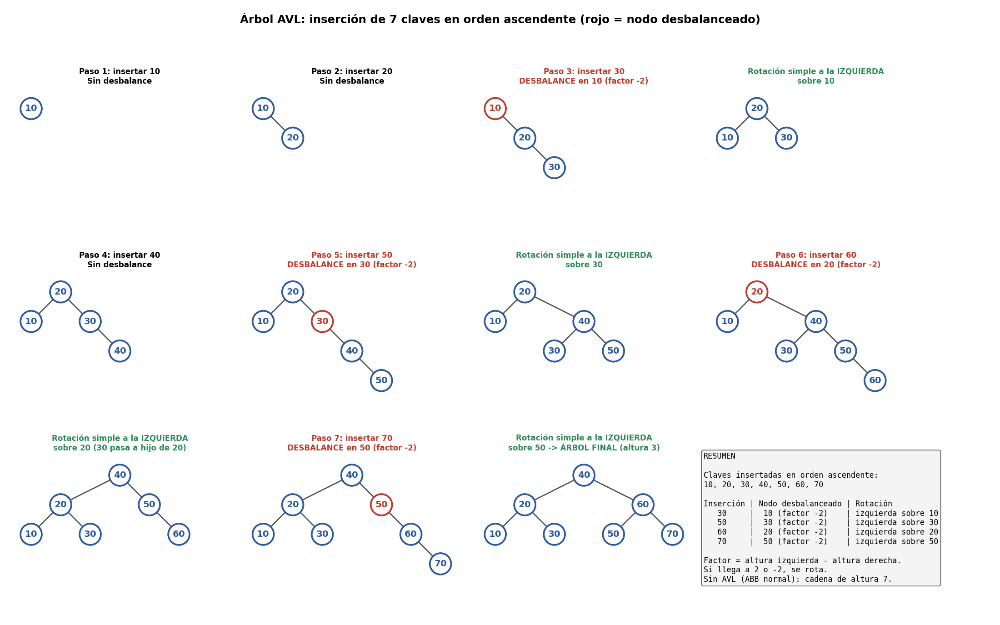
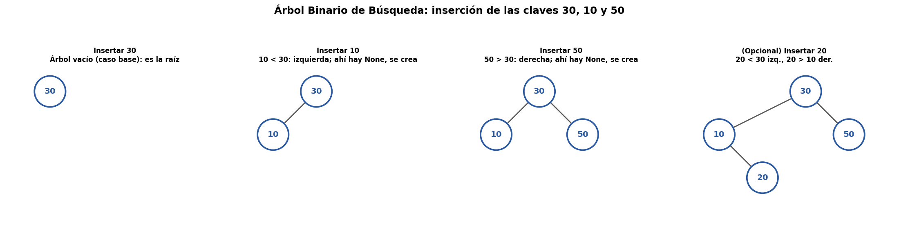
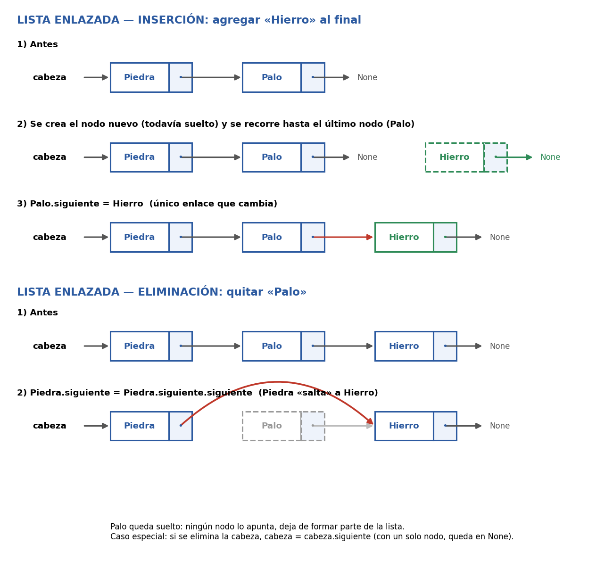

# Sistema de Inventario y Crafteo de Videojuegos

## 1. Nombre del sistema
**Sistema de Inventario y Crafteo de Videojuegos**

---

## 2. Descripción no técnica del caso
Este sistema simula la administración de objetos e inventario para un personaje de videojuego. Permite al jugador:
- Guardar, buscar y retirar objetos de su mochila.
- Mantener un historial para deshacer las últimas acciones realizadas.
- Consultar un catálogo de ítems mediante un código identificador numérico (ID).
- Consultar recetas de crafteo para saber qué elementos se pueden combinar entre sí para fabricar nuevos objetos.

---

## 3. Diagrama o listado de las clases y de la estructura que usa cada componente

### **Componente 1: Mochila (Inventario)**
- `Mochila`: Clase base (interfaz o contrato).
- `MochilaArreglo`: Utiliza un **Arreglo de tamaño fijo**.
- `NodoObjeto`: Nodo básico (`dato`, `siguiente`).
- `MochilaListaEnlazada`: Utiliza una **Lista Simplemente Enlazada**.

### **Componente 2: Historial (Deshacer)**
- `Pila`: Clase base para comportamiento LIFO (Last In, First Out).
- `PilaArreglo`: Utiliza un **Arreglo de tamaño fijo** con índice de cima.
- `NodoPila`: Nodo básico para la pila enlazada.
- `PilaListaEnlazada`: Utiliza una **Lista Simplemente Enlazada**.

### **Componente 3: Catálogo por ID**
- `NodoArbol`: Nodo que almacena `clave`, `nombre`, e hijos `izquierda` y `derecha`.
- `ArbolBinarioBusqueda`: Utiliza un **Árbol Binario de Búsqueda (ABB)**.

### **Componente 4: Recetas de Crafteo**
- `NodoVertice`: Nodo que representa un ítem, contiene su lista de objetos combinables (`MochilaListaEnlazada`) y puntero al siguiente vértice.
- `Grafo`: Utiliza una **Lista de Adyacencia** basada en listas enlazadas para representar un grafo no dirigido.

---

## 4. Justificación técnica de cada estructura elegida

- **Arreglo (Mochila / Pila):** Adecuado cuando el inventario o historial tiene una capacidad máxima estricta y definida desde el inicio. Ocupa memoria contigua.
- **Lista Enlazada (Mochila / Pila):** Permite gestionar memoria de forma dinámica. La estructura crece y se reduce a medida que se agregan o quitan objetos, evitando límites rígidos.
- **Pila (LIFO):** Es la estructura idónea para la función "Deshacer" (Undo), pues la última acción registrada es siempre la primera en revertirse.
- **Árbol Binario de Búsqueda (ABB):** Permite organizar los objetos por un código ID y realizar búsquedas de forma jerárquica, además de permitir recorridos ordenados (Inorden).
- **Grafo con Lista de Adyacencia:** Estructura óptima para representar relaciones N a N, permitiendo conectar bidireccionalmente los objetos que se combinan para craftear.

---

## 5. Comparación entre la implementación con arreglo y lista enlazada

| Operación | Implementación con Arreglo | Implementación con Lista Enlazada |
| :--- | :--- | :--- |
| **Insertar / Agregar** | **O(1)** (al final si hay espacio) / **O(N)** si busca casilla libre o valida duplicados. | **O(1)** (en la cabeza) / **O(N)** (al final o validando duplicados). |
| **Eliminar / Quitar** | **O(N)** (se recorre para encontrar el objeto y dejar el slot libre). | **O(N)** (se recorre para encontrar el nodo y reconectar punteros). |
| **Buscar** | **O(N)** (búsqueda secuencial) / **O(1)** si se conoce el índice exacto. | **O(N)** (recorrido secuencial nodo a nodo). |
| **Uso de Memoria** | Fijo. Reserva todo el espacio contiguo desde la creación ($O(\text{Capacidad})$). | Dinámico. Ocupa memoria según uso ($O(N)$), aunque requiere punteros extra. |

## 6. Tabla del experimento de alturas y su explicación

### **Tabla de Resultados (15 Claves)**

| Condición de Inserción | Cantidad Datos | Altura Obtenida |
| :--- | :---: | :---: |
| **Claves Desordenadas** | 15 | 5 |
| **Claves Ordenadas** | 15 | 15 |

### **Explicación:**
- **Claves Desordenadas:** Al insertar las claves en orden no secuencial, los nodos se reparten entre las ramas izquierda y derecha de manera equilibrada, manteniendo una altura baja de aproximadamente $O(\log_2 N)$.
- **Claves Ordenadas:** Al insertar datos previamente ordenados, cada elemento nuevo se ubica siempre a la derecha del anterior. El árbol pierde su forma ramificada y se degenera en una **lista enlazada**, alcanzando una altura máxima igual al número total de elementos ($O(N)$).

---

## 7. Fotografía o imagen del dibujo de las rotaciones AVL





## 8. Instrucciones para ejecutar el programa

1. Asegúrate de tener instalado **Python 3** en tu computador.
2. Guarda el código fuente en un archivo llamado `sistema_inventario.py`.
3. Abre una consola o terminal de comandos en la carpeta donde guardaste el archivo.
4. Ejecuta el comando:

```bash
python sistema_inventario.py